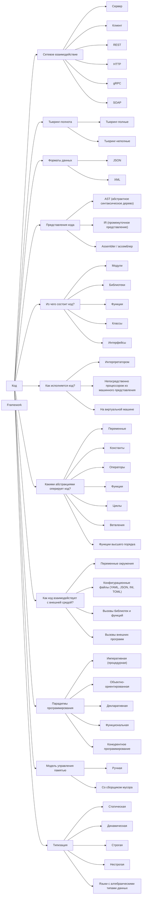

# Свойства кода

```mermaid
flowchart LR
  kg02_root["Код"]
  kg02_network["Сетевое взаимодействие"]
  kg02_server["Сервер"]
  kg02_client["Клиент"]
  kg02_rest["REST"]
  kg02_http["HTTP"]
  kg02_grpc["gRPC"]
  kg02_soap["SOAP"]
  kg02_turing["Тьюринг-полнота"]
  kg02_complete["Тьюринг-полные"]
  kg02_incomplete["Тьюринг-неполные"]
  kg02_formats["Форматы данных"]
  kg02_json["JSON"]
  kg02_xml["XML"]
  kg02_representation["Представления кода"]
  kg02_ast["AST (абстрактное синтаксическое дерево)"]
  kg02_ir["IR (промежуточное представление)"]
  kg02_assembler["Assembler / ассемблер"]
  kg02_composition["Из чего состоит код?"]
  kg02_modules["Модули"]
  kg02_libraries["Библиотеки"]
  kg02_functions["Функции"]
  kg02_classes["Классы"]
  kg02_interfaces["Интерфейсы"]
  kg02_execution["Как исполняется код?"]
  kg02_interpreted["Интерпретатором"]
  kg02_native["Непосредственно процессором из машинного представления"]
  kg02_virtual_machine["На виртуальной машине"]
  kg02_abstractions["Какими абстракциями оперирует код?"]
  kg02_variables["Переменные"]
  kg02_constants["Константы"]
  kg02_operators["Операторы"]
  kg02_functions_abstract["Функции"]
  kg02_loops["Циклы"]
  kg02_branches["Ветвления"]
  kg02_higher_order["Функции высшего порядка"]
  kg02_external["Как код взаимодействует с внешней средой?"]
  kg02_envvars["Переменные окружения"]
  kg02_config["Конфигурационные файлы (YAML, JSON, INI, TOML)"]
  kg02_lib_calls["Вызовы библиотек и функций"]
  kg02_subprocess["Вызовы внешних программ"]
  kg02_paradigms["Парадигмы программирования"]
  kg02_imperative["Императивная (процедурная)"]
  kg02_oop["Объектно-ориентированная"]
  kg02_declarative["Декларативная"]
  kg02_functional["Функциональная"]
  kg02_concurrent["Конкурентное программирование"]
  kg02_memory["Модель управления памятью"]
  kg02_manual["Ручная"]
  kg02_gc["Со сборщиком мусора"]
  kg02_typing["Типизация"]
  kg02_static["Статическая"]
  kg02_dynamic["Динамическая"]
  kg02_strong["Строгая"]
  kg02_weak["Нестрогая"]
  kg02_algebraic["Языки с алгебраическими типами данных"]
  kg02_framework["Framework"]
  kg02_root --> kg02_network
  kg02_network --> kg02_server
  kg02_network --> kg02_client
  kg02_network --> kg02_rest
  kg02_network --> kg02_http
  kg02_network --> kg02_grpc
  kg02_network --> kg02_soap
  kg02_root --> kg02_turing
  kg02_turing --> kg02_complete
  kg02_turing --> kg02_incomplete
  kg02_root --> kg02_formats
  kg02_formats --> kg02_json
  kg02_formats --> kg02_xml
  kg02_root --> kg02_representation
  kg02_representation --> kg02_ast
  kg02_representation --> kg02_ir
  kg02_representation --> kg02_assembler
  kg02_root --> kg02_composition
  kg02_composition --> kg02_modules
  kg02_composition --> kg02_libraries
  kg02_composition --> kg02_functions
  kg02_composition --> kg02_classes
  kg02_composition --> kg02_interfaces
  kg02_root --> kg02_execution
  kg02_execution --> kg02_interpreted
  kg02_execution --> kg02_native
  kg02_execution --> kg02_virtual_machine
  kg02_root --> kg02_abstractions
  kg02_abstractions --> kg02_variables
  kg02_abstractions --> kg02_constants
  kg02_abstractions --> kg02_operators
  kg02_abstractions --> kg02_functions_abstract
  kg02_abstractions --> kg02_loops
  kg02_abstractions --> kg02_branches
  kg02_abstractions --> kg02_higher_order
  kg02_root --> kg02_external
  kg02_external --> kg02_envvars
  kg02_external --> kg02_config
  kg02_external --> kg02_lib_calls
  kg02_external --> kg02_subprocess
  kg02_root --> kg02_paradigms
  kg02_paradigms --> kg02_imperative
  kg02_paradigms --> kg02_oop
  kg02_paradigms --> kg02_declarative
  kg02_paradigms --> kg02_functional
  kg02_paradigms --> kg02_concurrent
  kg02_root --> kg02_memory
  kg02_memory --> kg02_manual
  kg02_memory --> kg02_gc
  kg02_root --> kg02_typing
  kg02_typing --> kg02_static
  kg02_typing --> kg02_dynamic
  kg02_typing --> kg02_strong
  kg02_typing --> kg02_weak
  kg02_typing --> kg02_algebraic
```
