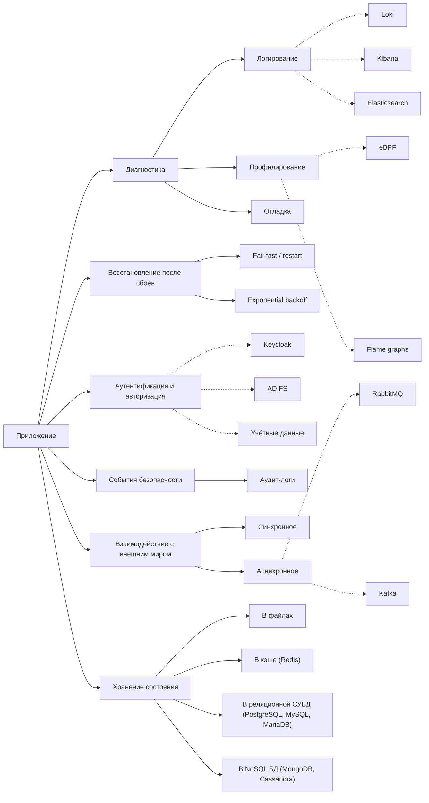

# KG-03 — Приложение

Сплошная стрелка — нарисована; пунктир — соседняя подпись, соотнесённая при цифровой транскрипции.

```mermaid
flowchart LR
  kg03_root["Приложение"]
  kg03_diagnostics["Диагностика"]
  kg03_logging["Логирование"]
  kg03_profiling["Профилирование"]
  kg03_debugging["Отладка"]
  kg03_loki["Loki"]
  kg03_kibana["Kibana"]
  kg03_elasticsearch["Elasticsearch"]
  kg03_ebpf["eBPF"]
  kg03_flamegraphs["Flame graphs"]
  kg03_recovery["Восстановление после сбоев"]
  kg03_fail_fast["Fail-fast / restart"]
  kg03_backoff["Exponential backoff"]
  kg03_identity["Аутентификация и авторизация"]
  kg03_keycloak["Keycloak"]
  kg03_adfs["AD FS"]
  kg03_credentials["Учётные данные"]
  kg03_security_events["События безопасности"]
  kg03_audit_logs["Аудит-логи"]
  kg03_external_interaction["Взаимодействие с внешним миром"]
  kg03_synchronous["Синхронное"]
  kg03_asynchronous["Асинхронное"]
  kg03_rabbitmq["RabbitMQ"]
  kg03_kafka["Kafka"]
  kg03_state_storage["Хранение состояния"]
  kg03_files["В файлах"]
  kg03_cache["В кэше (Redis)"]
  kg03_rdbms["В реляционной СУБД (PostgreSQL, MySQL, MariaDB)"]
  kg03_nosql["В NoSQL БД (MongoDB, Cassandra)"]
  kg03_root --> kg03_diagnostics
  kg03_diagnostics --> kg03_logging
  kg03_diagnostics --> kg03_profiling
  kg03_diagnostics --> kg03_debugging
  kg03_logging -.-> kg03_loki
  kg03_logging -.-> kg03_kibana
  kg03_logging -.-> kg03_elasticsearch
  kg03_profiling -.-> kg03_ebpf
  kg03_profiling -.-> kg03_flamegraphs
  kg03_root --> kg03_recovery
  kg03_recovery --> kg03_fail_fast
  kg03_recovery --> kg03_backoff
  kg03_root --> kg03_identity
  kg03_identity -.-> kg03_keycloak
  kg03_identity -.-> kg03_adfs
  kg03_identity -.-> kg03_credentials
  kg03_root --> kg03_security_events
  kg03_security_events --> kg03_audit_logs
  kg03_root --> kg03_external_interaction
  kg03_external_interaction --> kg03_synchronous
  kg03_external_interaction --> kg03_asynchronous
  kg03_asynchronous -.-> kg03_rabbitmq
  kg03_asynchronous -.-> kg03_kafka
  kg03_root --> kg03_state_storage
  kg03_state_storage --> kg03_files
  kg03_state_storage --> kg03_cache
  kg03_state_storage --> kg03_rdbms
  kg03_state_storage --> kg03_nosql
```
